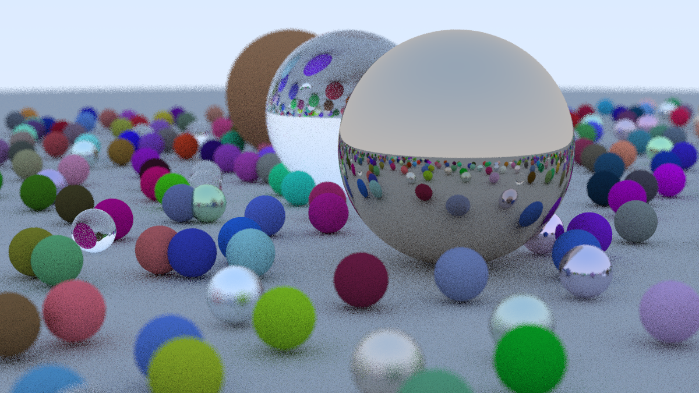

# Ray-Tracing

An implementation of a simple Ray Tracer in C++ by using the tutorial described in the book [Ray Tracing in One Weekend](https://raytracing.github.io/books/RayTracingInOneWeekend.html).

